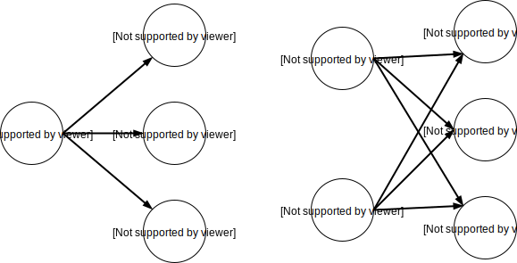
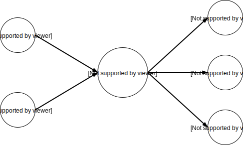

NATS Client Module
==================

References
----------

* `https://en.wikipedia.org/wiki/Publish–subscribe_pattern <https://en.wikipedia.org/wiki/Publish–subscribe_pattern>`_
* https://en.wikipedia.org/wiki/Message_broker
* https://aws.amazon.com/pub-sub-messaging/
* https://nats.io/blog/openiot/
* https://nats-io.github.io/docs/

Concept: Publish/subsribe messaging pattern
-------------------------------------------

* Aka PUBSUB or Topic Broadcasting
* Messaging pattern that allows **publishers** to multicast (one-to-many) messages to zero or more **subscribers**
* Subscribers can subscribe to **specific topics**, allowing them to receive only messages that are relevant to them
* Form of asynchronous service-to-service communication that enables event-driven architectures
* Allows decoupling of applications into smaller, independent building blocks
* This increases performance, reliability and scalability

* A first topolgy is where a subscriber connects directly to a publisher
* Subscribers can be connected to multiple publishers
* But a separate connection needs to be established to every publisher
* The disadvantage is that the subscribers need to know all possible publishers

|

* A different topolgy is to use an intermediary central service between publishers and subscribers
* Called a **message broker** or event bus
* Publishers post messages to the broker and subscribers register subscriptions to the broker
* The broker uses a **store-and-forward mechanism** to route the messages with a certain topic
* A disadvantage is that there is an extra hop in the messaging network
* An other disadvantage is that the central broker can fail, which disrupts all messaging traffic

|

* The application protocol for PUBSUB patterns will include message types to:

  - Subscribe (and unsubscribe) to a topic from the peer or broker
  - Publish a message on a certain topic to all peers or a broker
  - Receive messages on the subscribed topics, the topic is usually included when receiving a message

* Application protocol example and encapsulation over TCP: receive the message *Hello World* under the topic *FOO.BAR*
* **Note:** the NATS protocol uses the symbols ``\r\n`` as escape sequences in the TCP stream to separate protocol
  units, these escape sequences have to be sent over the socket

.. image:: images/pub-sub-03.svg
    :align: center

|

Assignment
----------

* Create a **NATS client protocol** module
* Provide support for the publish-subscribe part of protocol
* Use raw POSIX sockets
* Create a header file for reuse in other programs
* Provide a (re)connection procedure for the TCP sockets in a state machine

Module API
----------

::

    #ifndef NSOCK_HDR
    #define NSOCK_HDR

    struct nsock_ctx;

    struct nsock_msg {
            char *topic;
            void *data;
            int data_len;
    };

    typedef void (*nsock_cb)(nsock_ctx *ctx, struct nsock_msg *msg, void *data);

    int nsock_open(const char *address, int port, struct nsock_ctx **ctx);
    int nsock_get_fd(struct nsock_ctx *ctx);
    int nsock_process(struct nsock_ctx *ctx);
    int nsock_subscribe(struct nsock_ctx *ctx, const char *topic,
                        struct nsock_cb cb, void *data);
    int nsock_publish_msg(struct nsock_ctx *ctx, struct nsock_msg *msg);
    int nsock_read_msg(struct nsock_ctx *ctx, struct nsock_msg *msg);

    #endif

Hints
-----

* Use an event loop (or poll mechanism) for handling the socket file descriptors

Questions
---------

* What are the most popular PUBSUB (or messaging in general) protocols?
* What other PUBSUB brokers exist? And wich protocol do they use?
