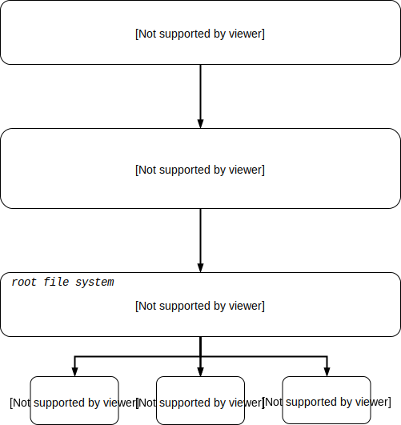
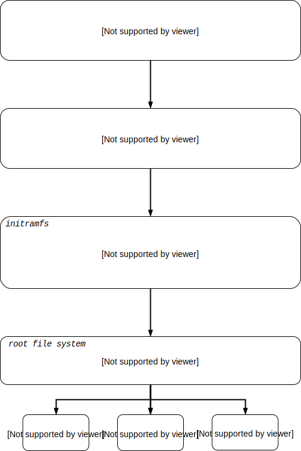

Linux Kernel Boot Process & Command Line Parameters
===================================================

.. _Bootlin: https://bootlin.com/doc/training/embedded-linux/embedded-linux-slides.pdf

References
----------

* Bootlin_ slides, chapter *Linux kernel introduction*
* Mainline kernel: https://www.kernel.org/

Goals
-----

* Understand the Linux kernel boot process
* Test the kernel + initramfs on an emulated ``x86_64`` system

.. TODO
   vmlinux = elf
   arch/x86_64/boot/bzImage Includes header
   3 ways to pass a root file system:
      cpio archive statically linked into the kernel
      cpio archive passed by the bootloader
      root= command line parameter with device partition, is actually the fallback root file system (after an initramfs)
   the init program must be found in the root file system
   4 types of file systems:
      block device backed filesystems (ext4, ...) (also ramdisk)
      pipe backed filesystems (FUSE, Samba, ...) (program backed)
      RAM backed filesystems (page cache) (ramfs and tmpfs) (way more memory efficient)
      synthetic/pseudo/virtual filesystems (proc, sysfs, ...)

Kernel Command Line Parameters
------------------------------

* Passed by the bootloader to the kernel.
* Kernel parses the arguments.
* https://www.kernel.org/doc/Documentation/admin-guide/kernel-parameters.txt
* Most important generic options:

=============== ====================================================    ===========
**Option**      **Description**                                         **Example**
--------------- ----------------------------------------------------    -----------
``console=``    kernel console output                                   ``console=tty1``
``elevator=``   IO scheduler selection                                  ``elevator=noop``
``init=``       init process to start by the kernel                     ``init=/usr/local/bin/myinit``
``rdinit=``     init process to start by the kernel inside initramfs    ``rdinit=/bin/sh``
``quiet``       disable most log messages
``root=``       root filesystem partition                               ``root=/dev/mmcblk0p2``
``rootdelay=``  seconds to wait before mounting root                    ``rootdelay=2``
``rootflags=``  root filesystem mount options                           ``rootflags=rw,noatime``
``rootwait``    wait indefinitly for root partition                     ``root=/dev/sda2 rootwait``
=============== ====================================================    ===========

Booting and Init
----------------

* The bootloader loads the kernel in RAM and starts execution.
* The kernel initializes itself and the drivers.
* Depending on kernel commandline parameters, it tries to mount the root filesystem.
* Depending on kernel commandline parameters, it starts the user space **init** program.
* The init program is the only process the kernel starts and is referenced as **PID 1**.
* The init program starts the rest of userspace and never exits.

|

Initramfs
---------

* Kernel can boot in **ramdisk** (legacy) or **initramfs**.
* Intermediary step before mounting the root filesystem and booting into it.
* Initramfs can be used to prepare next booting stage (root partition, ...).
* Can be appended to the kernel image, or can be loaded seperately by the bootloader.
* Packaged in **cpio** archive, optionally compressed.
* The initramfs is extracted into a **tmpfs** filesystem in RAM.
* https://www.kernel.org/doc/Documentation/filesystems/ramfs-rootfs-initramfs.txt

|

Virtual filesystems proc and sysfs
----------------------------------

* The ``proc`` virtual filesystem is provided by the kernel.
* It provides:

  - Process statistics and process run time information
  - User access to adjust run time parameters (process management, ...)

* It has to be mounted in user space (``mount -t proc nodev /proc``).
* Used by many common applications (``ps``, ``top``, ...).
* https://www.kernel.org/doc/Documentation/filesystems/proc.txt
* ``man 5 proc``
* Process specific information located in directory per process ``/proc/<pid>``.
* Examples:

======================= ======================================================
**proc entry**          **Description**
----------------------- ------------------------------------------------------
``/proc/cmdline``       kernel command line at boot
``/proc/cpuinfo``       list of available cpu's in the system
``/proc/filesystems``   list of available filesystems by the kernel
``/proc/partitions``    list of partitions in the system
``/proc/self``          symlink to ``/proc/<pid>`` of process which opens file
``/proc/self/cmdline``  command line which started process
``/proc/self/comm``     process command
``/proc/self/cwd``      symlink to current working directory
``/proc/self/exe``      symlink to binary which was used for ``exec``
``/proc/self/environ``  process environment variables
``/proc/self/fd``       overview of all opened file descriptors of process
``/proc/self/limits``   process attributes (stack size, core dump size, ...)
``/proc/self/mounts``   overview of mounted filesystems
======================= ======================================================

* The ``sysfs`` virtual filesystem is provided by the kernel.
* It provides an hierarchical directory structured view of the buses, devices and drivers the kernel manages on the system.
* It has to be mounted in user space (``mount -t sysfs nodev /sys``).
* Used by applications to communicate with hardware (drivers) (``udev``, ``ip link``, ...).
* https://www.kernel.org/doc/Documentation/filesystems/sysfs.txt
* Examples:

================================== ===================================
**sys entry**                      **Description**
---------------------------------- -----------------------------------
``/sys/class/net/enp0s25/address`` MAC address of interface enp0s25
``/sys/class/net/enp0s25/carrier`` carrier signal of interface enp0s25
================================== ===================================

Kernel Logging
--------------

* The ``dmesg`` command dumps the kernel log ring buffer.
* Kernel log messages are also sent to ``syslogd`` or ``klogd``, these log daemons write the logs to ``/var/log/messages``.
* The kernel log buffer size can be set in the kernel configuration (``CONFIG_LOG_BUF_SHIFT``).
* Example: inserting a USB flash drive, a way to get the dynamic mapping of the inserted device:

::

     ...
     [618.381500] usb 1-1.2: new high-speed USB device number 4 using ehci-pci
     [618.491472] usb 1-1.2: New USB device found, idVendor=0781, idProduct=5583
     [618.491476] usb 1-1.2: New USB device strings: Mfr=1, Product=2, SerialNum
     [618.491478] usb 1-1.2: Product: Ultra Fit
     [618.491480] usb 1-1.2: Manufacturer: SanDisk
     [618.491481] usb 1-1.2: SerialNumber: 4C530001190526106240
     [618.554722] usb-storage 1-1.2:1.0: USB Mass Storage device detected
     [618.554829] scsi host6: usb-storage 1-1.2:1.0
     [618.554943] usbcore: registered new interface driver usb-storage
     [618.566518] usbcore: registered new interface driver uas
     [619.559076] scsi 6:0:0:0: Direct-Access SanDisk  Ultra Fit 1.00 PQ: 0 ANS
     [619.559658] sd 6:0:0:0: Attached scsi generic sg1 type 0
     [619.560156] sd 6:0:0:0: [sdb] 60062500 512-byte logical blocks: 30.8 GB
     [619.561591] sd 6:0:0:0: [sdb] Write Protect is off
     [619.561595] sd 6:0:0:0: [sdb] Mode Sense: 43 00 00 00
     [619.563817] sd 6:0:0:0: [sdb] Write cache: disabled, read cache: enabled,
     [619.576674]  sdb: sdb1
     [619.580158] sd 6:0:0:0: [sdb] Attached SCSI removable disk
     [619.916117] EXT4-fs (sdb1): mounted filesystem with ordered data mode. Op

Steps
-----

1.  Build a kernel for x86$\_$64 and test it in **qemu**:
::

    user@host: qemu-system-x86_64 -M pc -no-reboot \
                -kernel ${LINUX_PATH}/linux-5.0.6/arch/x86/boot/bzImage \
                -append "panic=1 console=tty1"

2. Create a simple custom init program (*init-hello-world.c*) to test ``rdinit=`` within qemu:

.. code-block:: c

   #include <stdio.h>
   #include <unistd.h>

   void main(void)
   {
       printf("hello world\n");
       sleep(99999999);
   }

3. Compile the test program with statically linked C library and strip it:
::

    user@host: mkdir -p /tmp/ramfs/sbin/
    user@host: gcc —static -o /tmp/ramfs/sbin/myinit /tmp/init-hello-world.c
    user@host: strip /tmp/ramfs/sbin/myinit

4. Create a root file system **cpio archive** which include the init program:
::

    user@host: cd /tmp/ramfs
    user@host: find . | cpio -o -H newc | gzip > /tmp/root.cpio.gz

5. Test the custom init and root file system archive:
::

    user@host: qemu-system-x86_64 -M pc -no-reboot \
                   -kernel ${LINUX_PATH}/linux-5.0.6/arch/x86/boot/bzImage \
                   -append "panic=1 console=tty1 rdinit=/sbin/myinit" \
                   -initrd /tmp/root.cpio.gz

Hints
-----

* The X11 qemu window can be bypassed, for example on a server or inside a container:

  - The ``stdio`` of the qemu machine is forwarded to the running terminal
  - Use the following options upon invocation: ``-nographic -append "...console=ttyS0"``

Assignments
-----------

* Test some use cases and generate some **kernel panics** to analyse.
* Reduce the size of the kernel by removing features, drivers, ... But make sure it still boots.

Questions
---------

* Check the kernel init sequence in the source: function ``kernel_init()`` in the file ``${LINUX_PATH}/init/main.c``
* What is the **sequence of init locations** the kernel searches by default?
* Why must the custom init program be statically linked? (try with dynamic linking also)
* How come the ``printf()`` function in the custom init program prints to the correct console?
* Let the custom init program return, analyse the kernel panic, why did it panic?
* Why can only a ``x86_64`` CPU be used? Why not an ARM CPU?
